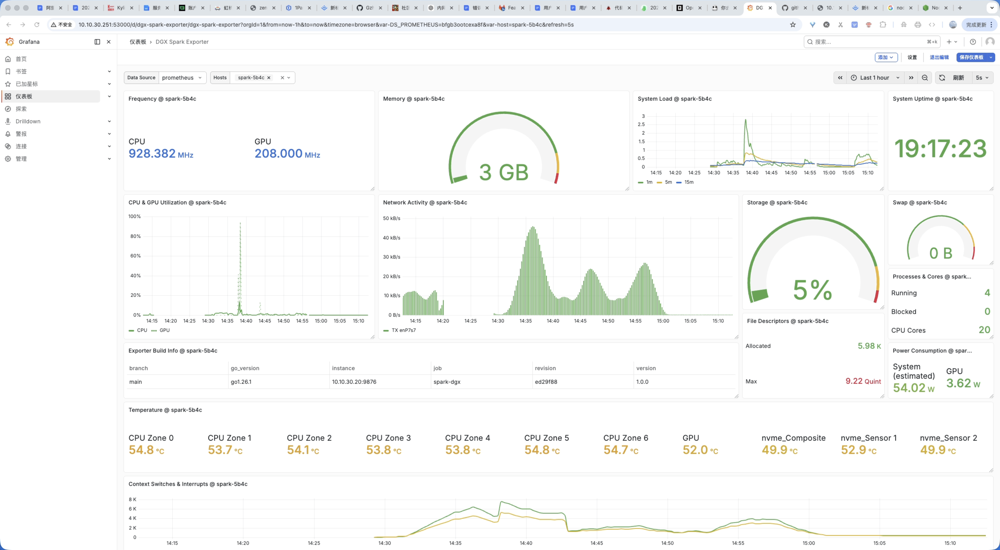

# DGX Spark Exporter

[](https://goreportcard.com/report/github.com/zy84338719/dgx-spark-exporter)
[](LICENSE)

[English](README.md) | 简体中文

一个专为 [NVIDIA DGX Spark](https://www.nvidia.com/en-us/products/workstations/dgx-spark/) 系统设计的 [Prometheus](https://prometheus.io) 指标导出器。

## 特性

- CPU 使用率、温度和频率监控
- 通过 nvidia-smi 获取 GPU 指标（利用率、温度、功耗、频率）
- 内存使用追踪
- 磁盘 I/O 和存储容量指标
- 网络流量统计
- 低开销，单二进制部署
- 符合 Prometheus Exporter 标准

## 端点

| 端点 | 描述 |
|------|------|
| `/` | 首页链接 |
| `/metrics` | Prometheus 指标 |
| `/health` | 健康检查（返回 `OK`） |
| `/ready` | 就绪检查（返回 `Ready`） |
| `/version` | 版本信息（JSON） |

## 指标列表

所有指标使用 `dgx_spark_` 命名空间前缀。

### CPU 指标

| 指标名 | 类型 | 标签 | 描述 |
|--------|------|------|------|
| `dgx_spark_cpu_usage_ratio` | Gauge | | CPU 使用率 (0-1) |
| `dgx_spark_cpu_temperature_celsius` | Gauge | zone, type | CPU 温度（摄氏度） |
| `dgx_spark_cpu_frequency_hertz` | Gauge | | CPU 平均核心频率（Hz） |
| `dgx_spark_cpu_time_seconds_total` | Counter | mode | 各模式 CPU 时间总计 |
| `dgx_spark_cpu_cores` | Gauge | | CPU 核心数 |

### GPU 指标

| 指标名 | 类型 | 描述 |
|--------|------|------|
| `dgx_spark_gpu_utilization_ratio` | Gauge | GPU 利用率 (0-1) |
| `dgx_spark_gpu_temperature_celsius` | Gauge | GPU 温度（摄氏度） |
| `dgx_spark_gpu_frequency_hertz` | Gauge | GPU 图形时钟频率（Hz） |
| `dgx_spark_gpu_power_watts` | Gauge | GPU 功耗（瓦特） |

### 内存指标

| 指标名 | 类型 | 描述 |
|--------|------|------|
| `dgx_spark_memory_total_bytes` | Gauge | 总内存（字节） |
| `dgx_spark_memory_used_bytes` | Gauge | 已用内存（字节） |
| `dgx_spark_memory_available_bytes` | Gauge | 可用内存（字节） |

### 磁盘指标

| 指标名 | 类型 | 标签 | 描述 |
|--------|------|------|------|
| `dgx_spark_disk_reads_completed_total` | Counter | device | 磁盘读取完成次数 |
| `dgx_spark_disk_writes_completed_total` | Counter | device | 磁盘写入完成次数 |
| `dgx_spark_disk_read_bytes_total` | Counter | device | 磁盘读取字节数 |
| `dgx_spark_disk_written_bytes_total` | Counter | device | 磁盘写入字节数 |

### 文件系统指标

| 指标名 | 类型 | 标签 | 描述 |
|--------|------|------|------|
| `dgx_spark_filesystem_size_bytes` | Gauge | mountpoint | 文件系统总大小（字节） |
| `dgx_spark_filesystem_avail_bytes` | Gauge | mountpoint | 文件系统可用空间（字节） |
| `dgx_spark_filesystem_used_ratio` | Gauge | mountpoint | 文件系统使用率 (0-1) |

### 网络指标

| 指标名 | 类型 | 标签 | 描述 |
|--------|------|------|------|
| `dgx_spark_network_receive_bytes_total` | Counter | interface | 接收字节数 |
| `dgx_spark_network_transmit_bytes_total` | Counter | interface | 发送字节数 |
| `dgx_spark_network_receive_packets_total` | Counter | interface | 接收包数 |
| `dgx_spark_network_transmit_packets_total` | Counter | interface | 发送包数 |
| `dgx_spark_network_receive_errors_total` | Counter | interface | 接收错误数 |
| `dgx_spark_network_transmit_errors_total` | Counter | interface | 发送错误数 |
| `dgx_spark_network_receive_dropped_total` | Counter | interface | 接收丢弃数 |
| `dgx_spark_network_transmit_dropped_total` | Counter | interface | 发送丢弃数 |

### 系统指标

| 指标名 | 类型 | 标签 | 描述 |
|--------|------|------|------|
| `dgx_spark_load_average` | Gauge | period | 系统负载（1m、5m、15m） |
| `dgx_spark_system_uptime_seconds` | Gauge | | 系统运行时间（秒） |
| `dgx_spark_processes_running` | Gauge | | 运行中的进程数 |
| `dgx_spark_processes_blocked` | Gauge | | 阻塞的进程数 |
| `dgx_spark_context_switches_total` | Counter | | 上下文切换总数 |
| `dgx_spark_interrupts_total` | Counter | | 中断总数 |
| `dgx_spark_file_descriptors_allocated` | Gauge | | 已分配的文件描述符数 |
| `dgx_spark_file_descriptors_free` | Gauge | | 空闲的文件描述符数 |
| `dgx_spark_file_descriptors_max` | Gauge | | 最大文件描述符数 |

### 交换空间指标

| 指标名 | 类型 | 描述 |
|--------|------|------|
| `dgx_spark_swap_total_bytes` | Gauge | 交换空间总量（字节） |
| `dgx_spark_swap_used_bytes` | Gauge | 已用交换空间（字节） |
| `dgx_spark_swap_free_bytes` | Gauge | 可用交换空间（字节） |

### 功耗指标

| 指标名 | 类型 | 标签 | 描述 |
|--------|------|------|------|
| `dgx_spark_system_power_watts` | Gauge | source | 系统功耗（瓦特） |
| `dgx_spark_cpu_package_power_watts` | Gauge | package | CPU 封装功耗（瓦特）(RAPL) |
| `dgx_spark_dram_power_watts` | Gauge | package | DRAM 功耗（瓦特）(RAPL) |

### 存储温度指标

| 指标名 | 类型 | 标签 | 描述 |
|--------|------|------|------|
| `dgx_spark_nvme_temperature_celsius` | Gauge | device | NVMe 温度（摄氏度） |
| `dgx_spark_disk_temperature_celsius` | Gauge | device | 磁盘温度（摄氏度） |

### 构建信息

| 指标名 | 类型 | 标签 | 描述 |
|--------|------|------|------|
| `dgx_spark_exporter_build_info` | Gauge | version, revision, branch, go_version | 构建信息 |

## 快速开始

### 编译

```bash
make build
```

### 运行

```bash
./dgx-spark-exporter
```

指标地址：`http://localhost:9876/metrics`

## 配置

### 命令行参数

| 参数 | 默认值 | 描述 |
|------|--------|------|
| `-listen` | `:9876` | 监听地址 |
| `-metrics-path` | `/metrics` | 指标端点路径 |
| `-log-level` | `info` | 日志级别 (debug, info, warn, error) |
| `-scrape-timeout` | `10s` | GPU 采集超时时间 |
| `-interfaces` | (自动) | 要监控的网络接口 |
| `-collectors` | `cpu,gpu,memory,disk,network,system,swap,power,storage` | 启用的采集器 |
| `-root-mount` | `/` | 存储指标的根挂载点 |
| `-thermal-zones` | `10` | 扫描的热区数量 |
| `-max-cpus` | `256` | 最大 CPU 核心扫描数 |
| `-power-source` | `auto` | 功耗监控源 (auto, rapl, acpi, estimated) |
| `-powercap-path` | `/sys/class/powercap` | powercap 接口路径 |

### 环境变量

| 变量 | 对应参数 |
|------|----------|
| `LISTEN_ADDR` | `-listen` |
| `METRICS_PATH` | `-metrics-path` |
| `LOG_LEVEL` | `-log-level` |
| `NETWORK_INTERFACES` | `-interfaces` |
| `COLLECTORS` | `-collectors` |

## 安装

### Systemd 服务（推荐）

```bash
# 安装并启动服务
sudo make service-install

# 查看状态
make service-status

# 查看日志
journalctl -u dgx-spark-exporter -f
```

### 服务管理

```bash
sudo make service-start      # 启动服务
sudo make service-stop       # 停止服务
sudo make service-restart    # 重启服务
make service-status          # 查看状态
sudo make service-uninstall  # 卸载服务
```

### 手动安装

```bash
sudo cp dgx-spark-exporter /usr/local/bin/
sudo cp deploy/dgx-spark-exporter.service /etc/systemd/system/
sudo systemctl daemon-reload
sudo systemctl enable --now dgx-spark-exporter
```

## Prometheus 配置

```yaml
scrape_configs:
  - job_name: 'dgx_spark'
    scrape_interval: 5s
    static_configs:
      - targets: ['spark1:9876', 'spark2:9876']
```

## Grafana 仪表盘

导入 `deploy/grafana-dashboard.json` 到 Grafana 即可使用现成的可视化面板。



## 项目结构

```
├── cmd/dgx-spark-exporter/  # 应用入口
├── pkg/collectors/          # 指标采集器
├── internal/                # 内部包
│   ├── config/              # 配置
│   └── logger/              # 日志
├── deploy/                  # 部署文件
├── Makefile
├── go.mod
└── README.md
```

## 数据来源

| 指标 | 来源 |
|------|------|
| CPU 使用率 | `/proc/stat` |
| CPU 温度 | `/sys/class/thermal/thermal_zone*/` |
| CPU 频率 | `/sys/devices/system/cpu/cpu*/cpufreq/` |
| CPU 时间 | `/proc/stat` |
| GPU 指标 | `nvidia-smi` |
| 内存 | `/proc/meminfo` |
| 交换空间 | `/proc/meminfo` |
| 磁盘 I/O | `/proc/diskstats` |
| 存储 | `statfs()` |
| 网络 | `/sys/class/net/*/statistics/` |
| 系统负载 | `/proc/loadavg` |
| 系统运行时间 | `/proc/uptime` |
| 进程 | `/proc/stat` |
| 文件描述符 | `/proc/sys/fs/file-nr` |
| 系统功耗 | `/sys/class/powercap/`, `nvidia-smi`, 估算 |
| NVMe 温度 | `/sys/class/hwmon/` |

## 开发

```bash
make fmt      # 格式化代码
make vet      # 运行 go vet
make test     # 运行测试
make lint     # 运行 golangci-lint
```

## 许可证

[BSD 3-Clause](LICENSE)

## 贡献

欢迎贡献！请提交 Issue 或 Pull Request。
